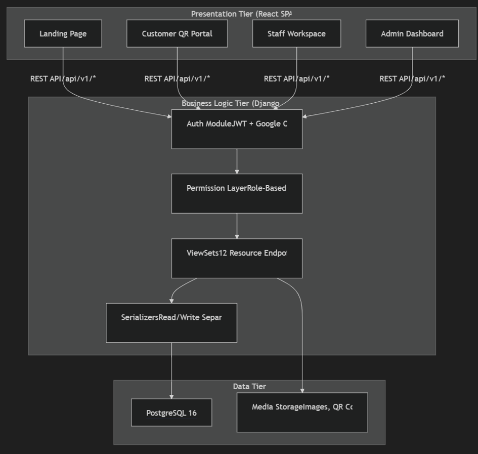
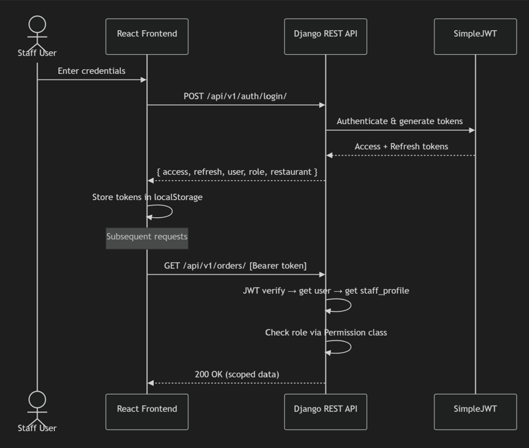
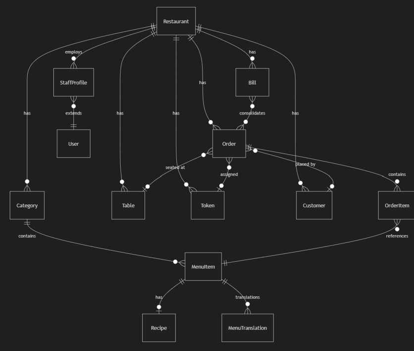

# 🍽️ Restaurant Management System

A full-stack, multi-tenant restaurant management platform with adaptive workflows (table-based, token-based, shop/biller), role-based access, QR menu ordering, and Docker deployment.

## Architecture

```
┌──────────────────┐     ┌──────────────────┐     ┌──────────────────┐
│   Frontend       │────▶│   Backend        │────▶│   PostgreSQL     │
│   React + Vite   │     │   Django + DRF   │     │   Database       │
│   Tailwind CSS   │     │   JWT Auth       │     │                  │
│   Nginx (:3000)  │     │   Gunicorn(:8000)│     │   (:5432)        │
└──────────────────┘     └──────────────────┘     └──────────────────┘
```

## Software Design

Savore follows a three-tier client–server architecture: a modern React 19 single-page application handles role-based user workflows, a modular Django REST backend manages business logic and access control, and PostgreSQL 16 guarantees persistent data isolation across tenants. High cohesion and loose coupling are enforced by decoupling UI components, API clients, and serializers, while server-side pricing and bill recalculation protect financial transactions from client tampering.

-  **[Design Assets Package (Draw.io Sources, PNGs, Screens)](docs/design/)**
-  **Diagram Sources**: [Architecture Diagram](docs/design/architecture.drawio) · [Authentication Flow](docs/design/authentication.drawio) · [Data Model](docs/design/datamodel.drawio)

### 1. High-Level System Architecture

A layered, three-tier architecture separates Presentation, Business Logic, and Data Persistence:



* **Presentation Tier**: React SPA divided into customer portals (QR ordering, reservations), staff workspaces (kitchen KDS, waiter floor), and admin dashboards.
* **Business Logic Tier**: Django REST Framework with SimpleJWT auth, role-based permission classes, resource ViewSets, and dedicated read/write serializers.
* **Data Tier**: Relational PostgreSQL 16 database scoped per restaurant tenant, with media storage for dish imagery and dynamic table QR codes.
* **Diagram Files**: [Editable Draw.io Source](docs/design/architecture.drawio) · [PNG Export](docs/design/architecture.png)

---

### 2. Authentication & Authorization Flow

Role-based access is secured through stateless JWT authentication:



* **Flow**: Staff submit credentials → SimpleJWT returns access and refresh tokens along with tenant and role metadata → React client stores tokens securely → Subsequent API requests include the Bearer token, which Django verifies against role permissions.
* **Diagram Files**: [Editable Draw.io Source](docs/design/authentication.drawio) · [PNG Export](docs/design/authentication.png)

---

### 3. Entity-Relationship Data Model

Multi-tenant relational database structure in Crow's Foot ER notation:



* **Tenancy & Isolation**: Top-level `Restaurant` entity anchors all data (`Category`, `MenuItem`, `Table`, `Token`, `Order`, `Bill`, `Customer`, `StaffProfile`).
* **Relational Integrity**: Orders map to tables or counter tokens; bills consolidate unpaid orders with automatic server-side tax and discount calculation.
* **Diagram Files**: [Editable Draw.io Source](docs/design/datamodel.drawio) · [PNG Export](docs/design/datamodel.png)

---

### 4. User Interface Design (6 Core Screens)

All UI interfaces are designed for low cognitive friction, responsive feedback, and quick execution in busy dining environments.

| Screen | View Name | Description | Preview |
| :---: | :--- | :--- | :---: |
| **1** | **Manager Analytics Portal** | Telemetry metrics, daily sales curves, top dish dispatch metrics, weekly shift rotations | [View Image](docs/design/Picture1.png) |
| **2** | **Staff Operations Dashboard** | Live Kanban floor pipeline (Pending, Preparing, Ready, Served) & table assignments | [View Image](docs/design/Picture2.png) |
| **3** | **Customer Table Reservation** | Date/time picker, interactive table floor map with seat availability, and confirmation modal | [View Image](docs/design/Picture3.png) |
| **4** | **Customer Digital Menu** | Category tabs, dish cards with pricing/descriptions/allergens, and live slide-out cart | [View Image](docs/design/Picture4.png) |
| **5** | **Kitchen Display System (KDS)** | Real-time chef ticket queue (Pending Prep, On the Stove, Ready, Done) with allergy alerts | [View Image](docs/design/Picture5.png) |
| **6** | **Admin Operations Overview** | Real-time revenue telemetry, table occupancy, average prep times, and live order stream | [View Image](docs/design/Picture6.png) |

---

### 5. Key Design Principles & Architectural Decisions

1. **Modularity & Layered Separation**: Frontend modules (`api/`, `components/`, `contexts/`, `pages/`) and backend Django apps are completely decoupled, allowing independent development, testing, and deployment.
2. **High Cohesion & Low Coupling**: Single-responsibility ViewSets handle discrete domain boundaries (`/orders/`, `/bills/`, `/menu-items/`), communicating via uniform JSON REST contracts.
3. **Abstraction**: Complex state handling (authentication, active cart, tenant theming) is abstracted behind React Context providers, shielding presentation components from implementation details.
4. **Server-Side Financial Security**: Client-submitted order prices are ignored; totals, taxes, and bills are computed strictly server-side from database records.
5. **Adaptive Workflows**: Supports three distinct operating models within one platform: Table-based QR ordering, Counter Token pickup, and Shop direct-billing.

## Tech Stack

| Layer      | Technology                                |
|------------|-------------------------------------------|
| Frontend   | React 19, Vite 8, Tailwind CSS v4         |
| Backend    | Django 5.1, Django REST Framework, SimpleJWT |
| Database   | PostgreSQL 16                              |
| Deployment | Docker, Docker Compose, Nginx, Gunicorn   |

## Quick Start (Docker) - Local Development

### Prerequisites
- [Docker](https://docs.docker.com/get-docker/) and [Docker Compose](https://docs.docker.com/compose/install/)

### Steps

1. **Clone the repository**
   ```bash
   git clone <repo-url>
   cd Restaurant-Management-System
   ```

2. **Copy environment variables**
   ```bash
   cp .env.example .env
   ```

3. **Build and start**
   ```bash
   docker-compose up --build
   ```

4. **Create superuser (admin)**
   ```bash
   docker-compose exec backend python manage.py createsuperuser
   ```

5. **Create your restaurant & staff profile**
   ```bash
   docker-compose exec backend python manage.py shell
   ```
   ```python
   from django.contrib.auth.models import User
   from restaurant.models import Restaurant, StaffProfile

   user = User.objects.get(username='your_admin_username')
   restaurant = Restaurant.objects.create(
       name='My Restaurant',
       slug='my-restaurant',
       owner=user,
       workflow_type='table',  # or 'token' or 'shop'
   )
   StaffProfile.objects.create(
       user=user,
       restaurant=restaurant,
       role='admin',
   )
   ```

6. **Access the application**
   - Frontend: [http://localhost:3000](http://localhost:3000)
   - Staff Login: [http://localhost:3000/login](http://localhost:3000/login)
   - Customer Menu: [http://localhost:3000/my-restaurant/menu](http://localhost:3000/my-restaurant/menu)
   - Django Admin: [http://localhost:8000/admin/](http://localhost:8000/admin/)
   - API: [http://localhost:8000/api/v1/](http://localhost:8000/api/v1/)

## Development Setup (Without Docker)

### Backend
```bash
cd server
python -m venv venv
source venv/bin/activate  # Windows: venv\Scripts\activate
pip install -r requirements.txt
python manage.py migrate
python manage.py createsuperuser
python manage.py runserver
```

### Frontend
```bash
cd client
npm install
npm run dev
```

The Vite dev server proxies `/api` requests to `http://localhost:8000`.

## User Roles

| Role    | Access                                          |
|---------|-------------------------------------------------|
| Admin   | Full access: menu, staff, tables, analytics, config |
| Waiter  | View orders, mark as served                     |
| Kitchen | View incoming orders, mark as preparing/ready   |
| Biller  | Lookup orders, generate bills, mark as paid     |
| Customer | QR scan → menu → order (no login required)     |

## Workflows

### Table-based
Each table has a QR code. Customer scans → sees menu → places order mapped to their table. Multiple orders allowed until biller marks table as paid.

### Token-based
Customer orders at counter → receives auto-generated token number. Uses token at pickup. QR codes for common menu display.

### Shop / Biller
Direct billing workflow. Biller enters items and generates bills.

## API Endpoints

| Endpoint                          | Method    | Auth Required | Description                  |
|-----------------------------------|-----------|---------------|------------------------------|
| `/api/v1/auth/login/`             | POST      | No            | Staff login (returns JWT)    |
| `/api/v1/auth/me/`                | GET       | Yes           | Current user profile         |
| `/api/v1/restaurants/`            | GET/POST  | Admin         | Restaurant CRUD              |
| `/api/v1/restaurants/{slug}/public/` | GET    | No            | Public restaurant info       |
| `/api/v1/categories/`             | GET/POST  | Admin/Public  | Category CRUD                |
| `/api/v1/menu-items/`             | GET/POST  | Admin/Public  | Menu item CRUD               |
| `/api/v1/recipes/`                | GET/POST  | Admin/Kitchen | Recipe CRUD (internal)       |
| `/api/v1/tables/`                 | GET/POST  | Admin         | Table CRUD                   |
| `/api/v1/tables/{id}/regenerate_qr/` | POST   | Admin         | Regenerate QR code           |
| `/api/v1/tokens/`                 | GET/POST  | Staff         | Token management             |
| `/api/v1/orders/`                 | GET/POST  | Any/Staff     | Order CRUD                   |
| `/api/v1/orders/{id}/update_status/` | PATCH  | Staff         | Update order status          |
| `/api/v1/orders/track/`           | GET       | No            | Track order by ID            |
| `/api/v1/orders/by_table/`        | GET       | No            | Orders by table + phone      |
| `/api/v1/bills/`                  | GET/POST  | Biller/Admin  | Bill CRUD                    |
| `/api/v1/bills/{id}/pay/`         | PATCH     | Biller/Admin  | Mark bill as paid            |
| `/api/v1/bills/lookup/`           | GET       | Biller/Admin  | Lookup unpaid orders         |
| `/api/v1/staff/`                  | GET/POST  | Admin         | Staff management             |
| `/api/v1/analytics/summary/`      | GET       | Admin         | Revenue summary              |
| `/api/v1/analytics/sales_by_day/` | GET       | Admin         | Daily sales chart data       |
| `/api/v1/analytics/popular_items/`| GET       | Admin         | Top ordered items            |
| `/api/v1/analytics/peak_hours/`   | GET       | Admin         | Orders by hour               |
| `/api/v1/analytics/revenue_by_category/` | GET | Admin       | Revenue by category          |

## Environment Variables

| Variable                | Default                          | Description               |
|------------------------|----------------------------------|---------------------------|
| `DJANGO_SECRET_KEY`     | insecure default                | Django secret key          |
| `DJANGO_DEBUG`          | True                            | Debug mode                 |
| `DJANGO_ALLOWED_HOSTS`  | localhost,127.0.0.1,0.0.0.0     | Allowed hosts              |
| `DB_NAME`               | rms_db                          | PostgreSQL database name   |
| `DB_USER`               | rms_user                        | PostgreSQL user            |
| `DB_PASSWORD`           | rms_password                    | PostgreSQL password        |
| `DB_HOST`               | db                              | PostgreSQL host            |
| `DB_PORT`               | 5432                            | PostgreSQL port            |
| `FRONTEND_URL`          | http://localhost:3000            | Frontend URL (for QR codes)|
| `CORS_ALLOWED_ORIGINS`  | http://localhost:3000,...        | Allowed CORS origins       |
| `VITE_API_URL`          | http://localhost:8000            | Backend API URL (frontend) |

## Project Structure

```
Restaurant-Management-System/
├── client/                      # Frontend (React + Vite + Tailwind)
│   ├── src/
│   │   ├── api/                 # API client layer
│   │   ├── components/          # Shared components
│   │   ├── contexts/            # React contexts (Auth, Cart, Theme)
│   │   ├── pages/
│   │   │   ├── admin/           # Admin dashboards
│   │   │   ├── auth/            # Login page
│   │   │   ├── biller/          # Biller views
│   │   │   ├── customer/        # Customer-facing pages
│   │   │   └── staff/           # Kitchen & waiter dashboards
│   │   ├── App.jsx              # Root component with routing
│   │   └── index.css            # Global styles & design system
│   ├── Dockerfile
│   ├── nginx.conf
│   └── package.json
├── server/                      # Backend (Django + DRF)
│   ├── restaurant/              # Main Django app
│   │   ├── models.py            # All data models
│   │   ├── serializers.py       # DRF serializers
│   │   ├── views.py             # DRF viewsets & API views
│   │   ├── permissions.py       # Role-based permissions
│   │   ├── signals.py           # Auto QR generation
│   │   ├── utils.py             # QR code & token utilities
│   │   ├── urls.py              # App URL routing
│   │   └── admin.py             # Django admin config
│   ├── server/
│   │   ├── settings.py          # Django settings
│   │   └── urls.py              # Project URL routing
│   ├── Dockerfile
│   ├── entrypoint.sh
│   └── requirements.txt
├── docker-compose.yml
├── .env.example
└── README.md
```
## Project Goals & Prioritization

### MoSCoW Prioritization

| Priority   | Features                                                                 |
|------------|--------------------------------------------------------------------------|
| **Must Have** | Role-based login (Admin, Manager, Staff, Customer), Reservations, Menu management, Order management, Billing workflow, JWT authentication |
| **Should Have** | Analytics dashboard (sales, popular items, peak hours), Staff scheduling, QR regeneration, Token workflow |
| **Could Have** | Customer feedback system, Loyalty points, Multi-language support, Mobile PWA |
| **Won’t Have (for now)** | AI-based demand forecasting, Advanced CRM integration, Third-party delivery partner APIs |

---

### Success Metrics

- Reduce double-bookings by **90%** through digital reservations  
- Improve order-to-delivery cycle time by **30%**  
- Increase customer satisfaction scores (feedback forms, ratings)  
- Achieve adoption by at least **3 pilot restaurants** in first release  
- Maintain **>99% uptime** in Dockerized deployment  

---

### Assumptions & Constraints

- Application requires **internet connectivity** for full functionality  
- Customers must have **QR-capable devices** for menu access  
- Deployment assumes **Docker runtime** and cloud hosting (Azure/Postgres)  
- Role-based authentication enforced via **JWT tokens**  
- Initial scope limited to **single-branch restaurants**, multi-branch scaling planned later  

## License

See [LICENSE](./LICENSE) file.
